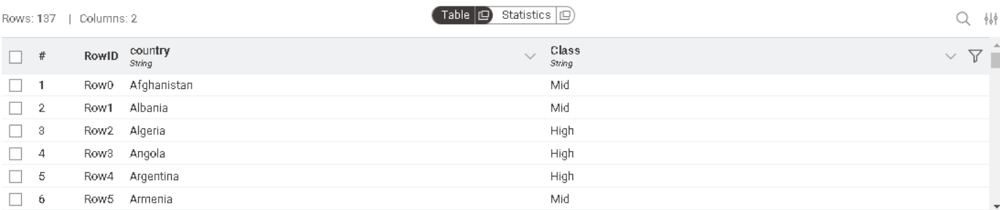
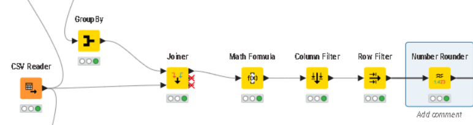
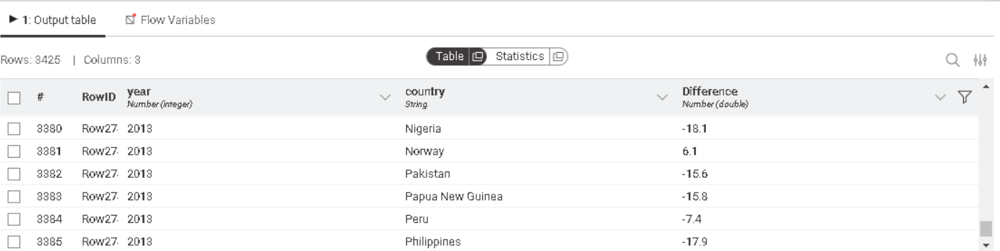
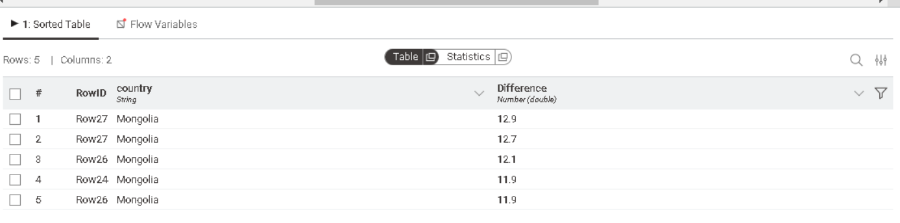
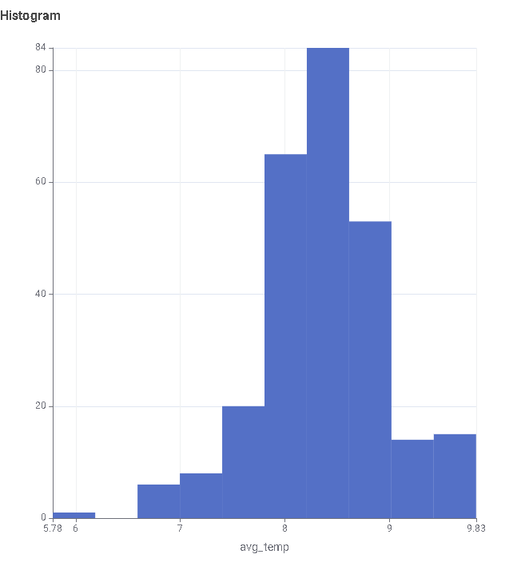

# Global & City Temperature Analysis using KNIME

## Datasets Used
1. **Global Temperatures Dataset:** Includes 2 columns: Year, and global_avg_temp of that year. It contains yearly average global temperatures.
2. **City Temperatures Dataset:** Includes 4 columns : Year, City, Country, Avg_Temp. It provides historical temperature records for specific cities.

## Project Requirements & Implementation

### Requirement 1: Output a table that has the overall average of each country.
#### Nodes used : 
1. **CSV Reader**: This node reads the csv file into KNIME's workflow. The csv file used for this requriement is the city temperatures csv.

2. **Row Filter**: I used this node in order to handle the missing values in the dataset. The row filter node includes only the rows that don't have missing values.

3. **Group By**: This node is used to show each country with its overall average temperature. I chose the country column to group by with since we want the average per country.

4. **Number Rounder**: This node rounds the avg_temp per country to 2 decimal places as is required in the sample table in the email.

#### WorkFlow for requirement 1:

#### Sample table for requirement 1:

---

### Requirement 2:  Classify the countries Temperature into “Low/Mid/High”

I used the output table from requirement 1 and added several steps tp classifiy the countries.
First of all, I checked the minimum and the maximum avg_temps using the **Group By** node. As we can see below, the minimum temperature is -14.35 and the maximum temperature is 30.73.

Next, as an additional analysis, i checked the minimum and the maximim temp recorded by each country to get an insight about the ranges of temperatures in each country.

In order to identify the ranges, i did the following: 
#### Step 1: Identify the range
minimum temperature: -14.35

maximum temperature: 30.73

Range = 30.73 - (-14.35) = 45.08

#### Step 2: Divide the Range into 3 Equal Parts
45.08 / 3 = 15.03

#### Step 3: Define the Temperature Ranges

Low: -14.35 to 0.68

(-14.35 + 15.03 = 0.68)

Mid: 0.69 to 15.71

(0.68 + 15.03 = 15.71)

High: 15.72 to 30.73

#### Nodes used :
1. **Group By**: To get the table from requirement 1 that contains the average temperature per country. I also used 2 other group by nodes. one to get the overall minimum and maximum temperatures, and another one to get the minimum and maximum temperatures for each country (for extra insights to understand the data better).

2. **Math Formula**: I used this node to classifiy the three ranges "Low", "Mid", "High". This is the code used:

$avg_temp$ <= 0.68 => "Low"

$avg_temp$ > 0.69 AND $avg_temp$ <= 15.71 => "Mid"

$avg_temp$ > 15.72 => "High"

I also changed the name of the column to **Class** as required.

3. **Column filter**: I used this node to show only the country and the class as required.

#### WorkFlow for requirement 2:

#### Sample table for requirement 2:

### Requirement 3: Output a table that has the difference between the average of the country in each year and the average global temp in the last 24 years.

#### Nodes used :
1. **Joiner node**: I used this node to join both datasets. I joined the **City Temperatures Dataset** with the **Global Temperatures Dataset** using **Year** as the key since this is the common column between both datasets. This resulted in a table with 4 columns: **Year**, **Country**, **Avg_temp_per_country**, **Global_avg_temp**.

2. **Math Formula**: I used the **Math Formula** node to create a new column called **"Difference"** that contains the difference between **global temperature** and **Avg_temp_per_country** for each year.

3. **Column Filter**: I used the **Column Filter** node to filter the 3 columns that are required in the output table. (**Year**, **Country**, **Difference**).

4. **Row Filter**: I used this node to filter the years to only include the last 24 years as required. I included years from 1989 to 2013.

5. **Numeric Rounder**: I used this node to round the difference column to 1 decimal place.

#### WorkFlow for requirement 3:

#### Sample table for requirement 3:

### Requirement 4:  Output a table that shows the top 5 countries that have the largest difference from the global Temp.

### Nodes used:

1. **Sorter**: I used this node to sort the results from the **Difference** table in **Requirement 3** in descending order to have the highest difference values at the top of the table.

2. **Column Filter**: I used this node to include only the **Country** and the **Difference** columns as required.

3. **Top K Row Filter**: I used this node to get the top 5 highest difference values from the table.

4. **Sorter**: I used the **Sorter** node again to sort the top 5 values in descending order.

#### WorkFlow for requirement 4:

#### Sample table for requirement 4:

As we can see from the above table, the 5 highest values in the difference from the global Temp belong to **Mongolia**. This makes sense because **Mongolia** is the only country that has an avergare temperature lower than 0 (-3.37).

If we take a deeper look into the table, we will find that the countries that had the greatest difference after **Mongolia** are: **Norway** , **Russia**, **Kazakhstan**, and **Finland**.

### Requirement 5: Draw a histogram for the yearly global temperatures

As we can see from the histogram, there is only 1 year that has an average temperature less than 6.0 (This can be an outlier compared to other temperatures). This is year **1750**. Also, we can notice that the greatest frequency (84) is for the avg_temperatures between 8.21 and 8.62.

### Requirement 6: Choose any city and draw a chart to compare between this city and global average temperature over the past years

I chose **Cairo** to compare between it's temperature and the global average temperature over the past years.

