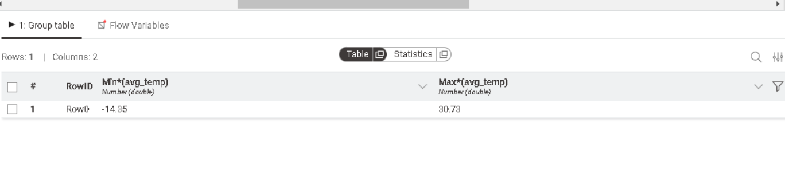
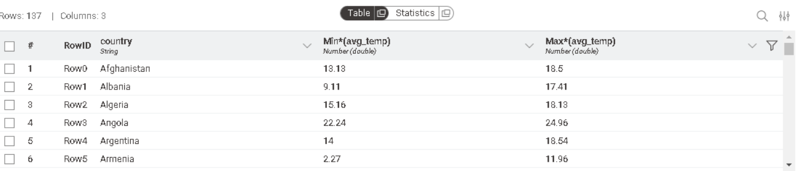

# Global & City Temperature Analysis using KNIME

## Datasets Used
1. **Global Temperatures Dataset:** Includes 2 columns: Year, and global_avg_temp of that year. It contains yearly average global temperatures.
2. **City Temperatures Dataset:** Includes 4 columns : Year, City, Country, Avg_Temp. It provides historical temperature records for specific cities.

## Project Requirements & Implementation

### Requirement 1: Output a table that has the overall average of each country.
#### Nodes used : 
1. **CSV Reader**: This node reads the csv file into KNIME's workflow. The csv file used for this requriement is the city temperatures csv.
2. **Row Filter**: I used this node in order to handle the missing values in the dataset. The row filter node includes only the rows that don't have missing values.
3. **Group By**: This node is used to show each country with its overall average temperature. I chose the country column to group by with since we want the average per country.
4. **Number Rounder**: This node rounds the avg_temp per country to 2 decimal places as is required in the sample table in the email.

#### WorkFlow for requirement 1:

#### Sample table for requirement 1:

---

### Requirement 2:  Classify the countries Temperature into “Low/Mid/High”

I used the output table from requirement 1 and added several steps tp classifiy the countries.
First of all, I checked the minimum and the maximum avg_temps using the **Group By** node. As we can see below, the minimum temperature is -14.35 and the maximum temperature is 30.73.

Next, as an additional analysis, i checked the minimum and the maximim temp recorded by each country to get an insight about the ranges of temperatures in each country.

#### Nodes used :

